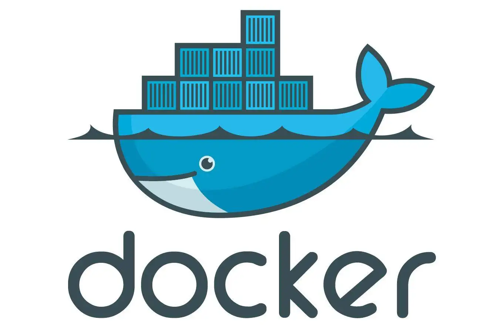

### Hi I'm f5l5y5 👋

<!--
**f5l5y5/f5l5y5** is a ✨ _special_ ✨ repository because its `README.md` (this file) appears on your GitHub profile.

Here are some ideas to get you started:

- 🔭 I’m currently working on ...
- 🌱 I’m currently learning ...
- 👯 I’m looking to collaborate on ...
- 🤔 I’m looking for help with ...
- 💬 Ask me about ...
- 📫 How to reach me: ...
- 😄 Pronouns: ...
- ⚡ Fun fact: ...
-->

<!--
https://metrics.lecoq.io/
https://gist.github.com/rxaviers/7360908
https://shields.io/
-->

# 💡skill

### 前端

<!--  -->
<!--  -->

<!--  -->

<!--  -->

### 后端

<!--  -->
<!--  -->

<!--  -->
<!--  -->
<!--  -->

### 运维端

